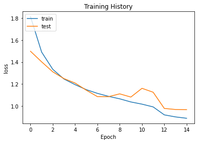
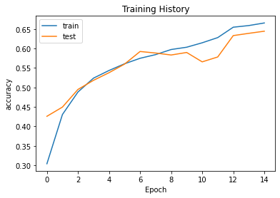

# Emotion Detection Project
## Introduction
Emotion Detection has always been an easy task for humans, but achieving the same task with a computer algorithm is quite challenging. With the recent advancement in computer vision and machine learning, it is possible to detect emotions from images.
In this project, facial emotions can be recognized using convolutional neural networks, snake and flask.
Facial expressions are the vital identifiers for human feelings, because it corresponds to the emotions. 
Most of the times (roughly in 55% cases), the facial expression is a nonverbal way of emotional expression, and it can be considered as concrete evidence to uncover whether an individual is speaking the truth or not.

## Mission objectives

- Be able to analyze and classify images of faces according to the facial-expression.
- Be able to analyze real-time images (video streaming) and implement facial-expression recognition.
- Explore techniques to identify emotions from subtle movements or gestures on the face.


## Coding Structure:

- Import the required Packages and Libraries.
- Data analysis and Creating Training and Validation Batches.
- Create a CNN using 4 Convolutional Layers including *Batch Normalization*,
*Activation*, *Max Pooling*, *Dropout* Layers followed by *Flatten* Layer, 2 Fully
*Connected dense* Layers and finally Dense Layer with *SoftMax* Activation
Function.
- Compile the model using `Adam` Optimizer and categorical cross entropy
loss function.
- Training the model for 15 epochs and then Evaluating the model as well as
saving the model Weights in `.h5` Values
- Saving the model as `JSON` string.
- Creating a Class in a separate file to reload the model and its weights to
make predictions and return the probabilities of each emotion.
- Creating one more class in a Separate file which takes in the `Real-time
Video input` and returns frames of Images with a Circle detecting the face
and putting text of its emotion on it.
- A python script is also created which upon running yields the `Graphical`
`Visualization` of Emotions present in the Image provided.
- Finally creating a file which inherits form all the Classes defined by us and
deploys our application using *Flask*.


## Dependencies

* Python 3, [OpenCV](https://opencv.org/), [Tensorflow](https://www.tensorflow.org/)
* To install the required packages, run `pip install -r requirements.txt`.

## Basic Usage

The repository is currently compatible with `tensorflow-2.0` and makes use of the Keras API using the `tensorflow.keras` library.

* First, clone the repository and enter the folder

```bash
git clone https://github.com/saifalbaghdadi/Emotion-detection.git
cd Emotion-detection
```

* If you want to train this model, use:  

```bash
cd src
python app.py --mode display
```

* The folder structure is of the form:  
  src:
  * data (folder)
  * Preprocessing (folder)
  * * Preprocessing (file)
  * model (folder)
  * `model_weights.h5` (file)
  * visual (folder)
  * * data (file)
  * * `haarcascade_frontalface_default.xml` (file)
  * * data (visual)
  * `emotions.py` (file)
  * 
  * `model.h5` (file)

* This implementation by default detects emotions on all faces in the webcam feed. With a simple 4-layer CNN, the test accuracy reached 64% in 15 epochs.




## Data Preparation (optional)

* The [original FER2013 dataset in Kaggle](https://www.kaggle.com/datasets/msambare/fer2013) is available as a single csv file. I had converted into a dataset of images in the PNG format for training/testing and provided this as the dataset in the previous section.

* In case you are looking to experiment with new datasets, you may have to deal with data in the csv format. I have provided the code I wrote for data preprocessing in the `dataset_prepare.py` file which can be used for reference.

## Algorithm

* First, the **haar cascade** method is used to detect faces in each frame of the webcam feed.

* The region of image containing the face is resized to **48x48** and is passed as input to the CNN.

* The network outputs a list of **softmax scores** for the seven classes of emotions.

* The emotion with maximum score is displayed on the screen.
